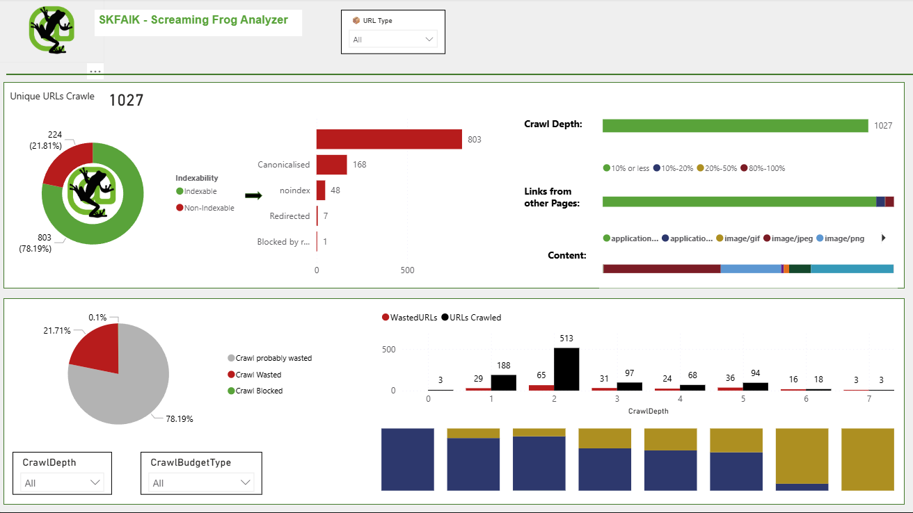
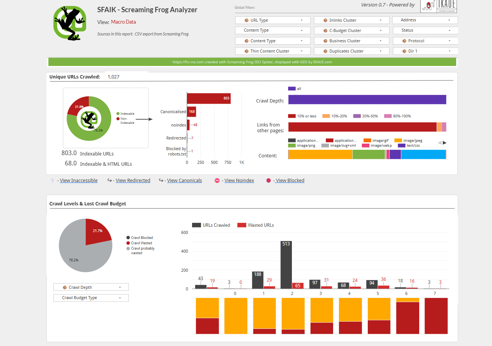
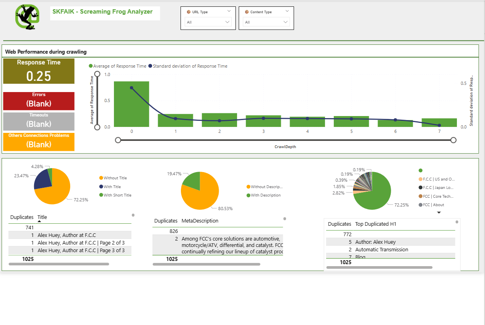
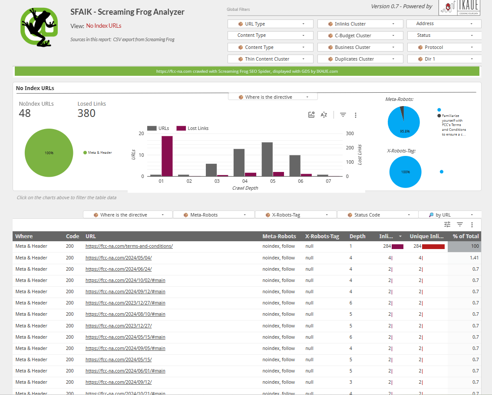
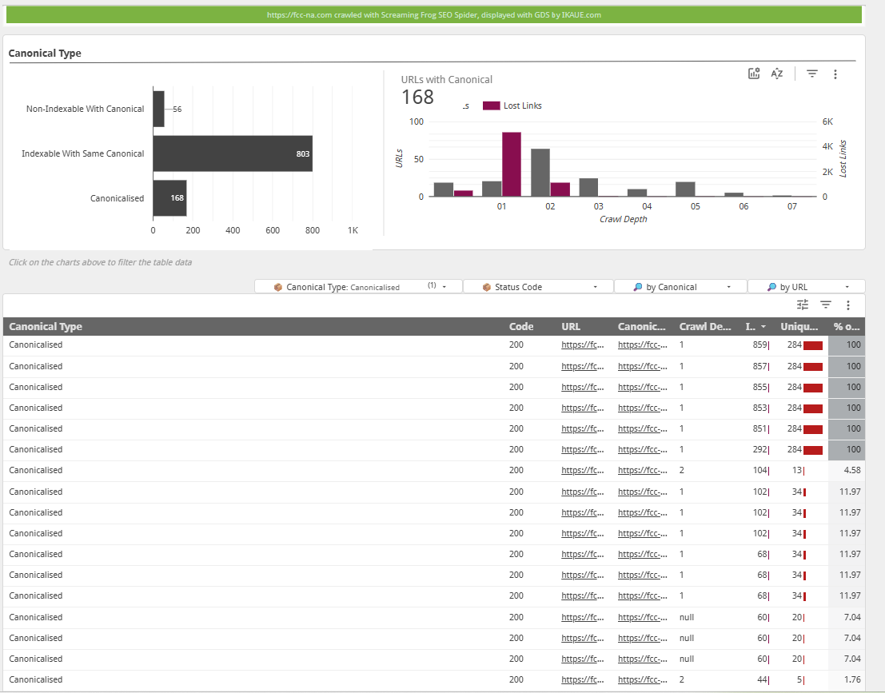

# 🐸 SFAIK – Screaming Frog SEO Analyzer Dashboard

> A multi-page **Looker Studio** dashboard built on Screaming Frog crawl data — surfacing indexability issues, crawl budget waste, technical SEO performance, and canonical problems in a single interactive report.

📊 **[View Live Dashboard →](https://datastudio.google.com/u/0/reporting/1c6a6a16-f54c-4aa0-b3a9-7b6ec2ab17d9/page/YzrVB)**

---

## 📌 Project Overview

Most SEO teams run Screaming Frog crawls and then stare at raw spreadsheet exports with thousands of rows. The insight is buried. This dashboard was built to fix that.

I connected Screaming Frog CSV exports to Looker Studio and built a structured, filterable 5-page report that turns crawl data into clear decisions — which URLs are wasting crawl budget, which pages are silently noindexed, and where canonicalisation is eating link equity.

**Client site analysed:** `fcc-na.com`
**Tool:** Screaming Frog → Looker Studio (Google Data Studio)
**Data source:** CSV export from Screaming Frog SEO Spider

---

## 📄 Dashboard Pages

### 1. Macro Data — Crawl Overview

A high-level summary of the entire crawl. At a glance: how many URLs are indexable, how deep the crawl went, and what content types are being discovered.

**Key metrics surfaced:**
- **1,027** unique URLs crawled
- **803** indexable URLs (78.2%) vs **224** non-indexable (21.8%)
- Crawl depth distribution across 7 levels
- Content type breakdown (HTML, image, CSS, JS)
- 168 canonicalised URLs | 48 noindex | 7 redirected | 1 blocked by robots.txt

---

### 2. Crawl Budget Analysis

Shows exactly where Googlebot is wasting its time — and your crawl budget. Broken down by crawl depth and budget type (blocked, wasted, probably wasted).

**Key findings:**
- **21.7%** of crawl budget is wasted or probably wasted
- Highest crawl volume sits at depth 2 (513 URLs crawled), also where wasted URLs spike
- Budget waste is present across all depth levels — not concentrated in one area

---

### 3. Performance Analysis — Web Performance During Crawling

Response time analysis across crawl depths, plus error monitoring (timeouts, connection issues).

**Key findings:**
- Average response time: **0.25 seconds** (healthy)
- Response time peaks at depth 1 (0.87s) then stabilises
- **0 errors**, **0 timeouts**, **0 connection problems** — site is technically stable
- Scatter plot of slow-loading URLs available for drill-down

---

### 4. No Index URLs

A dedicated view of the 48 noindex URLs discovered — including how many internal links they're absorbing (lost link equity).

**Key findings:**
- **48** noindex URLs consuming **380 lost internal links**
- All directives set via Meta & Header (no X-Robots-Tag conflicts)
- `terms-and-conditions` page alone absorbs **284 inlinks** while being noindexed
- Noindex URLs clustered between crawl depths 4–6

---

### 5. Canonical Type Analysis

Breaks down canonicalised URLs by type and surfaces which pages are pointing internal link equity to canonical targets.

**Key findings:**
- **168** canonicalised URLs identified
- **803** URLs correctly pointing to themselves (self-canonical)
- **56** non-indexable URLs carrying canonical tags
- Several canonicalised pages absorbing 284+ inlinks each — significant equity flow to review

---

## 🛠️ Tools Used

| Tool | Purpose |
|------|---------|
| Screaming Frog SEO Spider | Site crawl & data extraction |
| Google Looker Studio | Dashboard visualisation |
| Google Sheets / CSV | Data source connector |

---

## 📁 How to Use This Report

1. Export a crawl from Screaming Frog as CSV
2. Upload to Google Sheets and connect as a data source in Looker Studio
3. Use the global filters (URL Type, Content Type, Status, Protocol, etc.) to slice data for any site
4. Each page can be navigated independently or used in sequence for a full SEO audit workflow

---

## 💡 Use Cases

- **Technical SEO audits** — surface indexability and crawl issues fast
- **Crawl budget optimisation** — identify wasted crawl at scale
- **Site migrations** — validate canonical and redirect logic post-launch
- **Monthly SEO health checks** — repeatable, filterable report for any site

---

## 👤 About

Built by **[Md Arshad Ahammed (Ash)](https://arshadadvisory.com)** — Marketing Performance Analyst specialising in GA4, GTM, Looker Studio, and technical analytics.

📬 [arshadadvisory.com](https://arshadadvisory.com)
